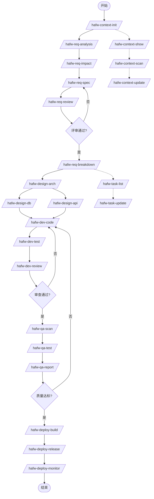

# HAFW 执行流程指南

## 概述

本文档详细描述 HAFW (High-efficiency AI Framework Workspace) 平台的完整执行流程，包含所有指令的执行顺序和约束条件。

---

## 完整指令清单

### 1. 上下文管理 (8个指令)
| 指令 | 说明 | 执行阶段 |
|------|------|---------|
| `/hafw-context-init` | 初始化项目上下文 | 项目启动时 |
| `/hafw-context-show` | 查看当前上下文状态 | 任意 |
| `/hafw-context-switch` | 切换项目上下文 | 多项目管理 |
| `/hafw-context-export` | 导出项目上下文 | 备份/迁移 |
| `/hafw-context-import` | 导入项目上下文 | 恢复/迁移 |
| `/hafw-context-timeline` | 查看项目时间线 | 任意 |
| `/hafw-context-scan` | 扫描代码更新上下文 | 开发中 |
| `/hafw-context-update` | 手动更新上下文 | 开发中 |

### 2. 需求管理 (5个指令)
| 指令 | 说明 | 优先级 |
|------|------|--------|
| `/hafw-req-analysis` | 分析用户需求 | P0 |
| `/hafw-req-impact` | 分析需求影响范围 | P0 |
| `/hafw-req-spec` | 生成需求规范文档 | P0 |
| `/hafw-req-review` | 评审需求 | P0 |
| `/hafw-req-breakdown` | 拆解需求生成任务 | P0 |

### 3. 任务管理 (2个指令)
| 指令 | 说明 |
|------|------|
| `/hafw-task-list` | 查看任务列表和进度 |
| `/hafw-task-update` | 更新任务状态和进度 |

### 4. 系统设计 (3个指令)
| 指令 | 说明 | 优先级 |
|------|------|--------|
| `/hafw-design-arch` | 架构设计 | P1 |
| `/hafw-design-db` | 数据库设计 | P1 |
| `/hafw-design-api` | API 设计 | P1 |

### 5. 代码开发 (3个指令)
| 指令 | 说明 | 优先级 |
|------|------|--------|
| `/hafw-dev-code` | 生成代码 | P2 |
| `/hafw-dev-test` | 生成测试代码 | P2 |
| `/hafw-dev-review` | 代码审查 | P2 |

### 6. 质量保障 (3个指令)
| 指令 | 说明 | 优先级 |
|------|------|--------|
| `/hafw-qa-scan` | 代码质量扫描 | P3 |
| `/hafw-qa-test` | 执行自动化测试 | P3 |
| `/hafw-qa-report` | 生成质量报告 | P3 |

### 7. 部署运维 (3个指令)
| 指令 | 说明 | 优先级 |
|------|------|--------|
| `/hafw-deploy-build` | 构建打包 | P4 |
| `/hafw-deploy-release` | 发布部署 | P4 |
| `/hafw-deploy-monitor` | 监控运维 | P4 |

**总计: 27个指令**

---

## 执行流程图



---

## 阶段执行流程

### 阶段 0: 项目初始化 (必须)

**执行指令**: `/hafw-context-init {项目名称}`

**约束条件**:
- 每个项目必须执行一次
- 必须在其他指令之前执行
- 会创建 `.hafw/` 目录结构

**输出目录**:
```
.hafw/
├── {项目名称}/           # 上下文目录
│   ├── contexts/      # 多维度上下文
│   │   ├── index.md
│   │   ├── api.md
│   │   ├── architecture.md
│   │   ├── data-models.md
│   │   ├── development.md
│   │   ├── coding-style.md
│   │   └── project-structure.md
│   ├── requirements/  # 需求上下文
│   ├── design/        # 设计上下文
│   ├── quality/       # 质量上下文
│   └── development/    # 开发上下文
```

---

### 阶段 1: 需求分析 (P0)

**执行顺序**:
1. `/hafw-req-analysis {需求描述}`
2. `/hafw-req-impact {需求ID}` (可选但推荐)
3. `/hafw-req-spec {需求ID}`
4. `/hafw-req-review {需求ID}`
5. `/hafw-req-breakdown {需求ID}`

**约束条件**:
- 必须先执行 `hafw-context-init`
- `hafw-req-spec` 依赖 `hafw-req-analysis` 的输出
- `hafw-req-review` 必须通过才能进入设计阶段
- `hafw-req-breakdown` 生成任务清单

**输出目录**:
```
.hafw/{项目名称}/requirements/
├── REQ-{日期}-{名称}.md      # 需求分析文档
├── IMPACT-{需求ID}.md        # 影响分析报告
├── PRD-{需求名称}.md         # 需求规范文档
├── REVIEW-{需求ID}.md        # 评审报告
└── TASKS-{需求ID}.md         # 任务清单
```

**检查点**: 需求评审必须通过 ✅

---

### 阶段 2: 系统设计 (P1)

**执行顺序**:
1. `/hafw-design-arch {PRD-ID}`
2. `/hafw-design-db {架构ID}` (可与API设计并行)
3. `/hafw-design-api {架构ID}` (可与数据库设计并行)

**约束条件**:
- 依赖已评审通过的 PRD 文档
- `hafw-design-db` 和 `hafw-design-api` 可并行执行
- 必须完成所有设计才能进入开发阶段

**输出目录**:
```
.hafw/{项目名称}/architecture/
├── ARCH-{架构ID}-{系统名称}.md    # 架构设计文档
├── DB-{设计ID}-{模块名称}.md      # 数据库设计文档
└── API-{设计ID}-{模块名称}.md     # API设计文档
```

---

### 阶段 3: 代码开发 (P2)

**执行顺序**:
1. `/hafw-dev-code {架构ID}`
2. `/hafw-dev-test {模块名称}`
3. `/hafw-dev-review {代码路径}`

**约束条件**:
- 依赖设计阶段完成
- `hafw-dev-review` 必须通过才能进入质量阶段
- 审查不通过需返回修改代码

---

### 阶段 4: 质量保障 (P3)

**执行顺序**:
1. `/hafw-qa-scan {范围}`
2. `/hafw-qa-test {模块}`
3. `/hafw-qa-report`

**约束条件**:
- 依赖代码审查通过
- 质量报告必须达标才能进入部署阶段
- 质量不达标需返回修改代码

---

### 阶段 5: 部署运维 (P4)

**执行顺序**:
1. `/hafw-deploy-build {环境}`
2. `/hafw-deploy-release {环境} {版本号}`
3. `/hafw-deploy-monitor {应用名称} {环境}`

**约束条件**:
- 依赖质量报告达标
- 生产环境部署需要额外审批
- 部署后必须配置监控

**输出目录**:
```
.hafw/{项目名称}/deployment/
├── BUILD-{构建ID}.md           # 构建报告
├── DEP-{部署ID}-{环境}.md      # 部署文档
└── MONITOR-{应用}-{环境}.md    # 监控配置
```

---

## 任务管理流程

任务管理贯穿整个开发周期：

```bash
# 查看任务列表
/hafw-task-list {需求ID}

# 更新任务状态
/hafw-task-update {任务ID} status={状态} progress={进度}
```

**任务状态流转**:
```
⬜ 未开始 → 🔄 待开发 → 🔄 开发中 → 🔄 待测试 → 🔄 测试中 → ✅ 已完成
```

---

## 上下文管理流程

上下文管理贯穿整个开发周期：

```bash
# 查看当前上下文
/hafw-context-show

# 扫描代码更新上下文
/hafw-context-scan --type=api

# 更新上下文
/hafw-context-update api --merge
```

---

## 依赖关系表

| 指令 | 依赖指令 | 依赖文件 | 说明 |
|------|---------|---------|------|
| hafw-req-analysis | hafw-context-init | 无 | 必须先初始化项目 |
| hafw-req-spec | hafw-req-analysis | REQ-*.md | 需要需求分析文档 |
| hafw-req-review | hafw-req-spec | PRD-*.md | 需要PRD文档 |
| hafw-req-breakdown | hafw-req-review | REVIEW-*.md | 需要评审通过 |
| hafw-design-arch | hafw-req-review | PRD-*.md | 需要评审通过的PRD |
| hafw-design-db | hafw-design-arch | ARCH-*.md | 需要架构设计 |
| hafw-design-api | hafw-design-arch | ARCH-*.md | 需要架构设计 |
| hafw-dev-code | hafw-design-db, hafw-design-api | 全部设计文档 | 需要设计完成 |
| hafw-dev-test | hafw-dev-code | 源代码 | 需要代码生成 |
| hafw-dev-review | hafw-dev-test | 代码+测试 | 需要测试生成 |
| hafw-qa-scan | hafw-dev-review | 源代码 | 需要审查通过 |
| hafw-qa-test | hafw-qa-scan | 源代码 | 需要扫描通过 |
| hafw-qa-report | hafw-qa-test | 测试报告 | 需要测试完成 |
| hafw-deploy-build | hafw-qa-report | 质量报告 | 需要质量达标 |
| hafw-deploy-release | hafw-deploy-build | 构建产物 | 需要构建完成 |
| hafw-deploy-monitor | hafw-deploy-release | 部署结果 | 需要部署完成 |

---

## 快速开始

### 标准执行流程

```bash
# 1. 初始化项目（必须）
/hafw-context-init 用户积分系统

# 2. 需求分析阶段
/hafw-req-analysis 实现用户积分系统
/hafw-req-spec REQ-001
/hafw-req-review PRD-用户积分系统
/hafw-req-breakdown REQ-001

# 3. 系统设计阶段
/hafw-design-arch PRD-用户积分系统
/hafw-design-db ARCH-001
/hafw-design-api ARCH-001

# 4. 代码开发阶段
/hafw-dev-code ARCH-001
/hafw-dev-test 用户积分系统
/hafw-dev-review src/main/java/com/hafw/

# 5. 质量保障阶段
/hafw-qa-scan all
/hafw-qa-test all
/hafw-qa-report

# 6. 部署运维阶段
/hafw-deploy-build prod
/hafw-deploy-release prod 1.0.0
/hafw-deploy-monitor 用户积分系统 prod
```

---

## 注意事项

1. **必须初始化**: 所有项目必须先执行 `hafw-context-init`
2. **阶段检查点**: 需求评审、代码审查、质量报告必须通过才能进入下一阶段
3. **并行执行**: 数据库设计和API设计可以并行执行
4. **循环迭代**: 审查不通过时需要返回修改
5. **上下文更新**: 建议定期执行 `hafw-context-scan` 保持上下文最新
