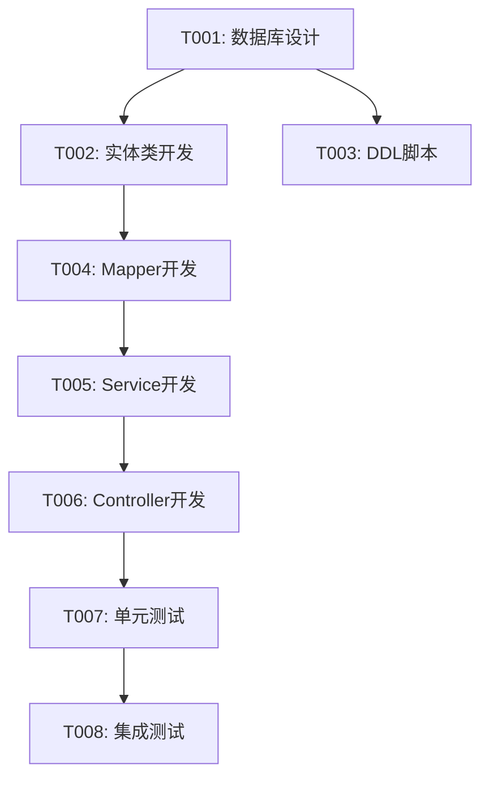

# HAFW 需求拆解指令

## 目标

将需求拆解为可执行的具体任务，分配给开发人员，并跟踪任务状态。

## 输入

- 需求ID
- 影响分析报告（可选）
- PRD 文档

## 执行步骤

### 1. 加载需求信息

读取需求相关文档：
- PRD 文档
- 影响分析报告
- 架构设计文档

### 2. 任务拆解

#### 2.1 按模块拆解
```
需求
├── 前端开发
│   ├── 页面开发
│   ├── 组件开发
│   └── 接口联调
├── 后端开发
│   ├── Controller
│   ├── Service
│   ├── Mapper
│   └── 单元测试
├── 数据库
│   ├── DDL脚本
│   └── DML脚本
└── 测试
    ├── 功能测试
    └── 集成测试
```

#### 2.2 按阶段拆解
| 阶段 | 任务 | 优先级 | 依赖 |
|-----|------|--------|------|
| 设计 | 数据库设计 | P0 | - |
| 设计 | API设计 | P0 | - |
| 开发 | 实体类开发 | P1 | 数据库设计 |
| 开发 | Mapper开发 | P1 | 实体类开发 |
| 开发 | Service开发 | P1 | Mapper开发 |
| 开发 | Controller开发 | P1 | Service开发 |
| 测试 | 单元测试 | P2 | 开发完成 |
| 测试 | 集成测试 | P2 | 单元测试 |

### 3. 生成任务清单

```markdown
# 任务清单

## 需求信息
| 项目 | 内容 |
|-----|------|
| 需求ID | {id} |
| 需求名称 | {name} |
| 创建日期 | {date} |
| 截止日期 | {deadline} |
| 总工作量 | {days} 人天 |

## 任务列表

### 任务 1: {任务名称}
| 属性 | 内容 |
|-----|------|
| 任务ID | T{需求ID}-001 |
| 类型 | 设计/开发/测试/部署 |
| 优先级 | P0/P1/P2/P3 |
| 状态 | ⬜ 未开始 |
| 负责人 | {owner} |
| 工作量 | {days} 天 |
| 开始时间 | - |
| 完成时间 | - |
| 依赖任务 | - |
| 描述 | {description} |
| 验收标准 | {criteria} |

### 任务 2: {任务名称}
| 属性 | 内容 |
|-----|------|
| 任务ID | T{需求ID}-002 |
| ... | ... |

## 任务依赖图


## 进度统计
| 状态 | 数量 | 占比 |
|-----|------|------|
| ⬜ 未开始 | {count} | {percent}% |
| 🔄 进行中 | {count} | {percent}% |
| ✅ 已完成 | {count} | {percent}% |
| ⏸️ 已暂停 | {count} | {percent}% |
| 总计 | {count} | 100% |

## 里程碑
| 里程碑 | 日期 | 包含任务 | 状态 |
|--------|------|---------|------|
| 设计完成 | {date} | T001-T003 | ⬜ |
| 开发完成 | {date} | T004-T006 | ⬜ |
| 测试完成 | {date} | T007-T008 | ⬜ |
| 上线发布 | {date} | 部署任务 | ⬜ |
```

### 4. 任务状态管理

任务状态流转：
```
⬜ 未开始 → 🔄 待开发 → 🔄 开发中 → 🔄 待测试 → 🔄 测试中 → ✅ 已完成
                ↓           ↓           ↓           ↓
              ⏸️ 已暂停   ⏸️ 已暂停   ⏸️ 已暂停   ⏸️ 已暂停
```

状态说明：
| 状态 | 图标 | 说明 | 可转换状态 |
|-----|------|------|-----------|
| 未开始 | ⬜ | 任务已创建，尚未开始 | 待开发、已暂停 |
| 待开发 | 🔄 | 等待开发人员开始 | 开发中、已暂停 |
| 开发中 | 🔄 | 正在开发中 | 待测试、已暂停 |
| 待测试 | 🔄 | 开发完成，等待测试 | 测试中、已暂停 |
| 测试中 | 🔄 | 正在测试中 | 已完成、已暂停 |
| 已完成 | ✅ | 任务已完成 | - |
| 已暂停 | ⏸️ | 任务暂停 | 任意状态 |

## 任务操作命令

### 更新任务状态
```bash
# 标记任务开始开发
/hafw-task-update T001 status=开发中

# 标记任务完成
/hafw-task-update T001 status=已完成

# 暂停任务
/hafw-task-update T001 status=已暂停 reason="等待接口文档"
```

### 查看任务进度
```bash
# 查看所有任务
/hafw-task-list {需求ID}

# 查看我的任务
/hafw-task-list --owner={username}

# 查看今日任务
/hafw-task-list --today
```

## 输出

### 任务清单文件
- 文件路径：`.hafw/{项目名称}/requirements/TASKS-{需求ID}.md`

### 控制台输出

```
=== HAFW 需求拆解结果 ===

需求ID: {id}
需求名称: {name}
拆解任务: {count} 个
总工作量: {days} 人天

任务列表:
⬜ T001: 数据库设计 (P0) - {owner} - {days}天
⬜ T002: 实体类开发 (P1) - {owner} - {days}天 [依赖: T001]
⬜ T003: Mapper开发 (P1) - {owner} - {days}天 [依赖: T002]
⬜ T004: Service开发 (P1) - {owner} - {days}天 [依赖: T003]
⬜ T005: Controller开发 (P1) - {owner} - {days}天 [依赖: T004]
⬜ T006: 单元测试 (P2) - {owner} - {days}天 [依赖: T005]
⬜ T007: 集成测试 (P2) - {owner} - {days}天 [依赖: T006]

里程碑:
📅 设计完成: {date} (T001-T003)
📅 开发完成: {date} (T004-T006)
📅 测试完成: {date} (T007-T008)

任务清单: {path}

下一步建议:
➡️ 运行 /hafw-task-assign 分配任务负责人
➡️ 运行 /hafw-dev-code 开始第一个开发任务
➡️ 运行 /hafw-workflow-guide next 查看智能推荐

常用命令:
# 更新任务状态
/hafw-task-update T001 status=开发中

# 查看任务进度
/hafw-task-list {需求ID}
```
