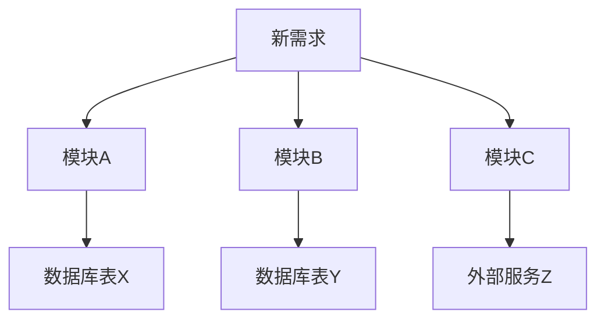

# HAFW 需求影响分析指令

## 目标

分析新需求对现有系统的全面影响，包括代码改动范围、依赖关系、风险评估等。

## 输入

- 需求ID 或 需求描述
- 现有系统架构文档
- 代码仓库

## 执行步骤

### 1. 需求理解

解析需求内容：
- 功能描述
- 涉及的业务领域
- 数据实体
- 接口变更

### 2. 系统扫描

扫描现有系统：
```bash
# 扫描代码结构
find src -type f -name "*.java" | head -50

# 扫描数据库表
mysql -e "SHOW TABLES"

# 扫描API接口
grep -r "@RestController" src/
```

### 3. 影响范围分析

#### 3.1 模块影响分析
| 模块 | 影响程度 | 说明 | 改动文件数 |
|-----|---------|------|-----------|
| {模块1} | 高/中/低 | {说明} | {count} |
| {模块2} | 高/中/低 | {说明} | {count} |

#### 3.2 数据库影响分析
| 表名 | 操作类型 | 影响 | DDL变更 |
|-----|---------|------|---------|
| {table} | 新增/修改/删除 | {说明} | ✅/❌ |

#### 3.3 接口影响分析
| 接口 | 变更类型 | 兼容性 | 影响客户端 |
|-----|---------|--------|-----------|
| {api} | 新增/修改/删除 | 兼容/不兼容 | {clients} |

### 4. 依赖关系分析



### 5. 生成影响分析报告

```markdown
# 需求影响分析报告

## 基本信息
| 项目 | 内容 |
|-----|------|
| 需求ID | {id} |
| 需求名称 | {name} |
| 分析日期 | {date} |
| 分析人 | HAFW AI |

## 影响概述
| 维度 | 影响程度 | 说明 |
|-----|---------|------|
| 代码改动 | 高/中/低 | {说明} |
| 数据库变更 | 高/中/低 | {说明} |
| 接口变更 | 高/中/低 | {说明} |
| 测试范围 | 高/中/低 | {说明} |
| 部署风险 | 高/中/低 | {说明} |

## 详细影响分析

### 1. 代码改动范围
#### 1.1 新增文件
| 文件路径 | 类型 | 说明 |
|---------|------|------|
| {path} | Controller/Service/Mapper | {说明} |

#### 1.2 修改文件
| 文件路径 | 修改类型 | 影响行数 | 说明 |
|---------|---------|---------|------|
| {path} | 新增方法/修改逻辑 | {lines} | {说明} |

#### 1.3 删除文件
| 文件路径 | 说明 | 替代方案 |
|---------|------|---------|
| {path} | {说明} | {替代} |

### 2. 数据库变更
#### 2.1 表结构变更
| 表名 | 变更类型 | 变更内容 | 回滚方案 |
|-----|---------|---------|---------|
| {table} | 新增字段 | {fields} | {rollback} |

#### 2.2 数据迁移
| 表名 | 迁移数据量 | 迁移脚本 | 预计时间 |
|-----|-----------|---------|---------|
| {table} | {count} | {script} | {time} |

### 3. 接口变更
#### 3.1 新增接口
| 接口 | 方法 | 说明 |
|-----|------|------|
| {api} | POST/GET/PUT/DELETE | {说明} |

#### 3.2 修改接口
| 接口 | 变更内容 | 兼容性 | 通知方 |
|-----|---------|--------|--------|
| {api} | {change} | 兼容/不兼容 | {teams} |

#### 3.3 废弃接口
| 接口 | 废弃原因 | 替代接口 | 下线时间 |
|-----|---------|---------|---------|
| {api} | {reason} | {alternative} | {date} |

### 4. 依赖影响
#### 4.1 内部依赖
| 依赖模块 | 影响说明 | 协调人 |
|---------|---------|--------|
| {module} | {impact} | {owner} |

#### 4.2 外部依赖
| 依赖服务 | 影响说明 | 协调人 |
|---------|---------|--------|
| {service} | {impact} | {owner} |

### 5. 风险评估
| 风险 | 可能性 | 影响 | 缓解措施 |
|-----|--------|------|---------|
| {risk} | 高/中/低 | 高/中/低 | {mitigation} |

## 工作量估算
| 任务类型 | 工作量(人天) | 负责人 | 依赖 |
|---------|-------------|--------|------|
| 需求分析 | {days} | {owner} | - |
| 设计 | {days} | {owner} | 需求分析 |
| 开发 | {days} | {owner} | 设计 |
| 测试 | {days} | {owner} | 开发 |
| 部署 | {days} | {owner} | 测试 |

## 建议
1. {建议1}
2. {建议2}
3. {建议3}
```

## 输出

### 影响分析报告
- 文件路径：`.hafw/{项目名称}/requirements/IMPACT-{需求ID}.md`

### 控制台输出

```
=== HAFW 需求影响分析结果 ===

需求ID: {id}
需求名称: {name}

影响概述:
🔴 代码改动: 高 (预计改动 {count} 个文件)
🟡 数据库变更: 中 (涉及 {count} 张表)
🟢 接口变更: 低 (新增 {count} 个接口)

改动范围:
📁 新增文件: {count} 个
📁 修改文件: {count} 个
📁 删除文件: {count} 个

数据库影响:
✅ 新增表: {count} 张
⚠️ 修改表: {count} 张
⬜ 无删除表

接口影响:
✅ 新增接口: {count} 个
⚠️ 修改接口: {count} 个 (不兼容: {count})
⬜ 废弃接口: {count} 个

工作量估算: {days} 人天
风险评估: {level}

详细报告: {path}

下一步建议:
➡️ 运行 /hafw-req-breakdown {需求ID}
   拆解需求生成具体任务

➡️ 运行 /hafw-workflow-guide next
   查看智能推荐
```
