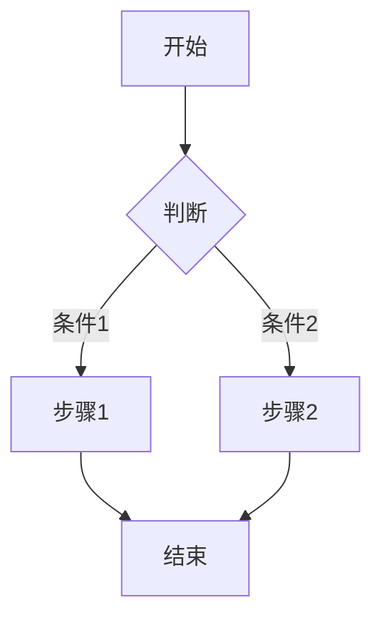
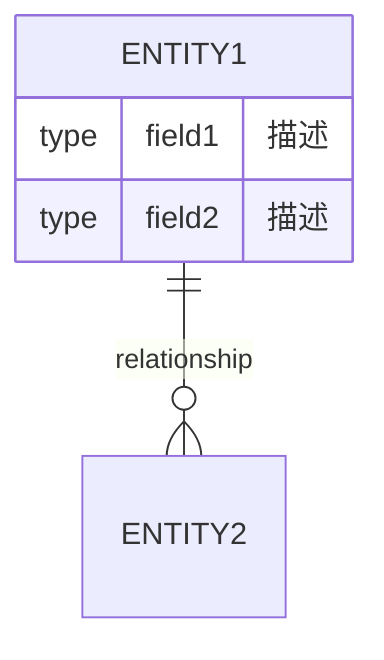

# HAFW 需求规范生成指令

## 目标

基于需求分析结果，生成标准化的需求规范文档（PRD），作为后续设计和开发的依据。

## 输入

- 需求分析文档路径（通过 $ARGUMENTS 或自动检测最新分析文档）
- 工作空间上下文

## 执行步骤

### 1. 加载需求分析文档

读取需求分析文档：
- 路径：`.hafw/{项目名称}/requirements/REQ-{日期}-{需求名称}.md`
- 提取：需求概述、功能需求、非功能需求、数据模型等

### 2. 生成 PRD 文档结构

创建标准化的 PRD 文档：

```markdown
# 产品需求文档 (PRD)

## 文档信息
| 项目 | 内容 |
|-----|------|
| 文档版本 | v1.0 |
| 创建日期 | {日期} |
| 作者 | HAFW AI Platform |
| 状态 | 草稿/评审中/已批准 |

## 1. 概述
### 1.1 背景
{业务背景描述}

### 1.2 目标
{产品目标}

### 1.3 范围
{功能范围}

## 2. 功能需求
### 2.1 用户故事
| ID | 用户角色 | 需求描述 | 优先级 | 验收标准 |
|----|---------|---------|--------|---------|
| US-001 | {角色} | {描述} | P0/P1/P2 | {标准} |

### 2.2 功能列表
| 模块 | 功能 | 描述 | 优先级 |
|-----|------|------|--------|
| {模块} | {功能} | {描述} | P0/P1/P2 |

### 2.3 业务流程


## 3. 非功能需求
### 3.1 性能需求
- 响应时间：{要求}
- 吞吐量：{要求}
- 并发数：{要求}

### 3.2 安全需求
- 认证：{要求}
- 授权：{要求}
- 数据加密：{要求}

### 3.3 可用性需求
- 可用性：99.9%
- 故障恢复：{要求}

## 4. 数据模型
### 4.1 实体关系图


### 4.2 数据字典
| 实体 | 字段 | 类型 | 约束 | 描述 |
|-----|------|------|------|------|
| {实体} | {字段} | {类型} | {约束} | {描述} |

## 5. 接口需求
### 5.1 外部接口
| 接口 | 协议 | 用途 | 说明 |
|-----|------|------|------|
| {接口} | {协议} | {用途} | {说明} |

## 6. 验收标准
### 6.1 功能验收
- [ ] 验收项1
- [ ] 验收项2

### 6.2 性能验收
- [ ] 性能指标1
- [ ] 性能指标2

## 7. 风险评估
| 风险 | 可能性 | 影响 | 缓解措施 |
|-----|--------|------|---------|
| {风险} | 高/中/低 | 高/中/低 | {措施} |

## 8. 附录
### 8.1 术语表
| 术语 | 定义 |
|-----|------|
| {术语} | {定义} |

### 8.2 参考文档
- {文档链接}
```

### 3. 填充内容

根据需求分析自动填充：
- 用户故事（基于功能点）
- 数据模型（基于实体提取）
- 业务流程图（Mermaid 格式）
- 接口需求（基于接口分析）

### 4. 生成验收标准

为每个功能点生成可测试的验收标准：

```
验收标准格式：
Given {前置条件}
When {操作}
Then {预期结果}
```

## 输出

### PRD 文档
- 文件路径：`.hafw/{项目名称}/requirements/PRD-{需求ID}-{需求名称}.md`

### 控制台输出

```
=== HAFW 需求规范生成结果 ===

PRD 文档: PRD-{需求ID}-{需求名称}.md
文档版本: v1.0
功能数量: {count} 个
用户故事: {count} 个
验收标准: {count} 条

文档结构:
✅ 概述
✅ 功能需求 ({count} 个模块)
✅ 非功能需求
✅ 数据模型 ({count} 个实体)
✅ 接口需求
✅ 验收标准
✅ 风险评估

下一步建议:
➡️ 运行 /hafw-req-review {PRD-ID}
   对 PRD 进行完整性和可行性评审

⚠️ 重要: 需求评审通过后才能进入设计阶段

或者查看智能推荐:
➡️ 运行 /hafw-workflow-guide next
3. 邀请相关人员进行 PRD 评审
```

## 参考模板

生成本文档时，请参考以下模板文件：
- **模板路径**: `hafw-platform/spec/requirement-spec.md`
- **模板说明**: HAFW 需求规范标准模板，包含完整的 PRD 文档结构

生成文档时应遵循模板的章节结构，包括：
1. 基本信息（需求ID、名称、优先级、状态等）
2. 背景与目标（业务背景、目标、成功指标）
3. 用户故事（目标用户、场景、验收标准）
4. 功能需求（功能清单、详细说明、业务规则、异常处理）
5. 非功能需求（性能、安全、可用性、兼容性）
6. 数据需求（数据实体、数据流、数据量预估）
7. 接口需求（内部/外部接口）
8. 界面原型（页面清单、原型链接）
9. 风险评估（风险清单、缓解措施）
10. 附录（术语表、参考资料、变更记录、评审记录）
