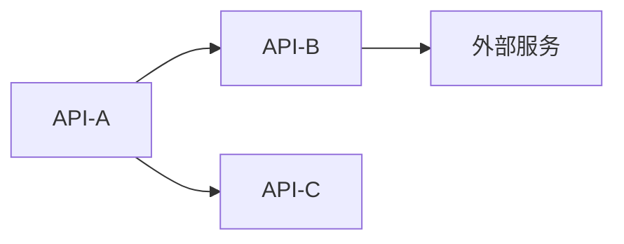

# HAFW API 上下文模板

## 基本信息

| 项目 | 内容 |
|-----|------|
| 上下文ID | API-{YYYYMMDD}-{序号} |
| 所属项目 | {项目名称} |
| 版本 | v{版本号} |
| 最后更新 | {YYYY-MM-DD HH:mm:ss} |
| 更新方式 | 手动/自动扫描 |
| 状态 | ✅ 最新 / ⚠️ 需更新 / ❌ 过时 |

---

## API 概览

### API 统计
| 类型 | 数量 | 说明 |
|-----|------|------|
| REST API | {count} | RESTful 接口 |
| GraphQL | {count} | GraphQL 接口 |
| WebSocket | {count} | 实时通信接口 |
| gRPC | {count} | RPC 接口 |
| 总计 | {count} | - |

### API 版本
| 版本 | 状态 | 发布时间 | 弃用时间 |
|-----|------|---------|---------|
| v1.0 | ✅ 当前 | {date} | - |
| v2.0 | 🔄 开发中 | {date} | - |

---

## REST API 清单

### 模块: {模块名称}

#### {接口名称}
| 属性 | 内容 |
|-----|------|
| 接口ID | API-{模块}-{序号} |
| 路径 | /api/v{版本}/{path} |
| 方法 | GET/POST/PUT/DELETE/PATCH |
| 状态 | ✅ 已上线 / 🔄 开发中 / ⏸️ 已弃用 |
| 最后验证 | {date} |

**请求参数:**

| 参数名 | 类型 | 必填 | 位置 | 说明 | 示例 |
|-----|-----|-----|-----|-----|-----|
| {param} | {type} | 是/否 | query/body/header | {desc} | {example} |

**响应结构:**
```json
{
  "code": 200,
  "message": "success",
  "data": {
    "{field}": "{type}"
  }
}
```

**错误码:**

| 错误码 | 说明 | 处理建议 |
|--------|------|---------|
| 400 | 请求参数错误 | 检查参数格式 |
| 401 | 未授权 | 检查 Token |
| 500 | 服务器错误 | 联系管理员 |

**变更历史:**

| 版本 | 日期 | 变更内容 | 状态 |
|-----|------|---------|------|
| v1.0 | {date} | 初始版本 | ✅ 当前 |

---

## GraphQL Schema

```graphql
type Query {
  {queryName}({params}): {returnType}
}

type Mutation {
  {mutationName}({params}): {returnType}
}

type {TypeName} {
  {field}: {type}
}
```

---

## WebSocket 接口

| 接口 | 事件 | 方向 | 说明 |
|-----|------|------|------|
| {name} | {event} | 发送/接收 | {desc} |

---

## API 依赖关系



---

## 验证状态

| 检查项 | 最后检查 | 状态 | 备注 |
|--------|---------|------|------|
| 接口可用性 | {date} | ✅/❌ | {note} |
| 文档完整性 | {date} | ✅/❌ | {note} |
| 参数一致性 | {date} | ✅/❌ | {note} |
| 响应格式 | {date} | ✅/❌ | {note} |

---

## 过时检测标记

<!-- 自动扫描时更新以下标记 -->
- [ ] 代码中发现了新的 API 端点但未记录
- [ ] 已有 API 的签名与代码不一致
- [ ] 文档中的 API 在代码中已删除
- [ ] 超过 30 天未验证 API 可用性

**检测时间**: {ISO8601_TIMESTAMP}
**检测结果**: ✅ 最新 / ⚠️ 存在差异 / ❌ 需要更新
