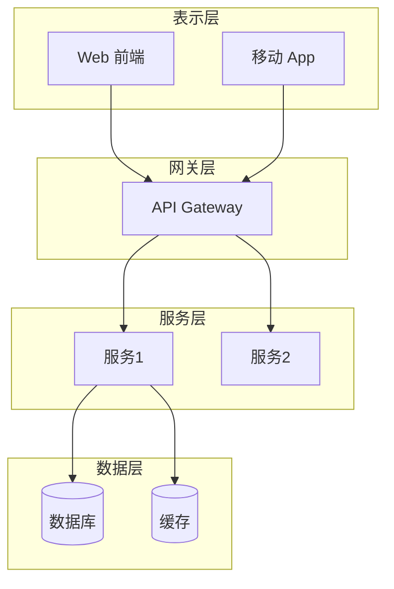
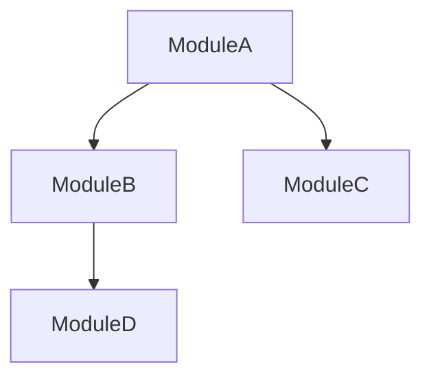

# HAFW 架构上下文模板

## 基本信息

| 项目 | 内容 |
|-----|------|
| 上下文ID | ARCH-CTX-{YYYYMMDD}-{序号} |
| 所属项目 | {项目名称} |
| 架构版本 | v{版本号} |
| 最后更新 | {YYYY-MM-DD HH:mm:ss} |
| 更新方式 | 手动/自动扫描 |
| 状态 | ✅ 最新 / ⚠️ 需更新 / ❌ 过时 |

---

## 架构概览

### 架构风格
- [ ] 单体架构
- [ ] 微服务架构
- [ ] 分层架构
- [ ] 事件驱动架构
- [ ] 其他: {说明}

### 技术栈
| 层次 | 技术 | 版本 | 最后验证 |
|-----|------|------|---------|
| 前端 | {tech} | {ver} | {date} |
| 后端 | {tech} | {ver} | {date} |
| 数据库 | {tech} | {ver} | {date} |
| 缓存 | {tech} | {ver} | {date} |
| 消息队列 | {tech} | {ver} | {date} |

---

## 系统架构图

---

## 组件清单

| 组件ID | 组件名称 | 类型 | 职责 | 状态 | 最后验证 |
|--------|---------|------|------|------|---------|
| COMP-001 | {name} | Service/Controller/Mapper | {desc} | ✅/❌ | {date} |

---

## 模块依赖

| 依赖方 | 被依赖方 | 依赖类型 | 说明 |
|--------|---------|---------|------|
| {from} | {to} | 强/弱 | {desc} |

---

## 设计模式

| 模式 | 应用场景 | 实现位置 |
|-----|---------|---------|
| {pattern} | {scenario} | {location} |

---

## 架构决策记录 (ADR)

### ADR-001: {决策标题}
| 属性 | 内容 |
|-----|------|
| 日期 | {date} |
| 状态 | 已接受/已拒绝/已废弃 |
| 上下文 | {context} |
| 决策 | {decision} |
| 后果 | {consequences} |

---

## 验证状态

| 检查项 | 最后检查 | 状态 | 备注 |
|--------|---------|------|------|
| 架构与代码一致性 | {date} | ✅/❌ | {note} |
| 依赖关系准确性 | {date} | ✅/❌ | {note} |
| 技术栈版本 | {date} | ✅/❌ | {note} |

---

## 过时检测标记

<!-- 自动扫描时更新以下标记 -->
- [ ] 代码中发现了新的组件但未记录
- [ ] 组件依赖关系与代码不一致
- [ ] 技术栈版本与配置文件不一致
- [ ] 架构图与实际代码结构不符
- [ ] 超过 30 天未验证架构一致性

**检测时间**: {ISO8601_TIMESTAMP}
**检测结果**: ✅ 最新 / ⚠️ 存在差异 / ❌ 需要更新
