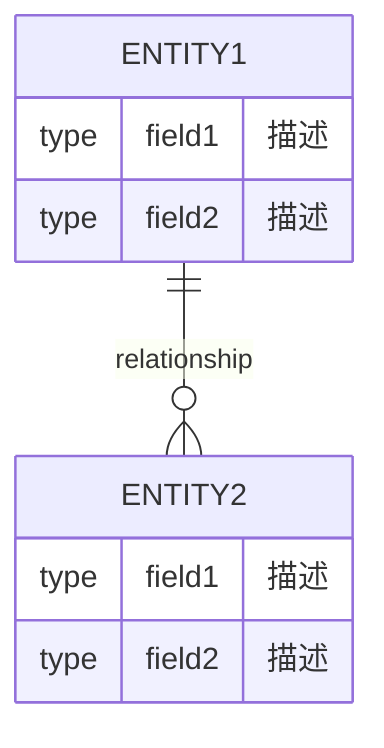

# HAFW 数据模型上下文模板

## 基本信息

| 项目 | 内容 |
|-----|------|
| 上下文ID | DATA-{YYYYMMDD}-{序号} |
| 所属项目 | {项目名称} |
| 版本 | v{版本号} |
| 最后更新 | {YYYY-MM-DD HH:mm:ss} |
| 更新方式 | 手动/自动扫描 |
| 状态 | ✅ 最新 / ⚠️ 需更新 / ❌ 过时 |

---

## 数据概览

### 数据库统计
| 类型 | 数量 | 说明 |
|-----|------|------|
| 数据库 | {count} | MySQL/PostgreSQL/MongoDB等 |
| Schema | {count} | 逻辑分组 |
| 表/集合 | {count} | 数据实体 |
| 视图 | {count} | 虚拟表 |
| 存储过程 | {count} | 数据库逻辑 |

### 数据量统计
| 表名 | 记录数 | 日增量 | 存储大小 |
|-----|--------|--------|---------|
| {table} | {count} | {count} | {size} |

---

## 实体关系图

---

## 数据实体清单

### 实体: {实体名称}

| 属性 | 内容 |
|-----|------|
| 实体ID | ENTITY-{序号} |
| 表名 | {table_name} |
| 说明 | {description} |
| 所属模块 | {module} |
| 最后验证 | {date} |

**字段定义:**

| 字段名 | 类型 | 长度 | 必填 | 默认值 | 索引 | 说明 |
|--------|------|------|------|--------|------|------|
| id | BIGINT | 20 | 是 | 自增 | PK | 主键 |
| {field} | {type} | {len} | 是/否 | {default} | {idx} | {desc} |

**索引:**

| 索引名 | 类型 | 字段 | 说明 |
|--------|------|------|------|
| idx_{name} | 普通/唯一/全文 | {fields} | {desc} |

**外键关系:**

| 字段 | 引用表 | 引用字段 | 级联操作 |
|------|--------|---------|---------|
| {field} | {table} | {field} | CASCADE/SET NULL |

**变更历史:**

| 版本 | 日期 | 变更类型 | 变更内容 |
|-----|------|---------|---------|
| v1.0 | {date} | 创建 | 初始版本 |
| v1.1 | {date} | 修改 | 添加字段 {field} |

---

## 数据字典

### 枚举类型

| 枚举名 | 值 | 说明 |
|--------|----|------|
| {EnumName} | {value} | {desc} |

### 常量定义

| 常量名 | 值 | 说明 |
|--------|----|------|
| {CONST} | {value} | {desc} |

---

## 数据流

| 步骤 | 操作 | 输入 | 输出 | 说明 |
|-----|------|------|------|------|
| 1 | {op} | {input} | {output} | {desc} |

---

## 数据安全

| 表名 | 敏感字段 | 加密方式 | 脱敏规则 |
|-----|---------|---------|---------|
| {table} | {fields} | AES/RSA | {rule} |

---

## 验证状态

| 检查项 | 最后检查 | 状态 | 备注 |
|--------|---------|------|------|
| 表结构与代码一致性 | {date} | ✅/❌ | {note} |
| 索引有效性 | {date} | ✅/❌ | {note} |
| 外键完整性 | {date} | ✅/❌ | {note} |
| 数据字典完整性 | {date} | ✅/❌ | {note} |

---

## 过时检测标记

<!-- 自动扫描时更新以下标记 -->
- [ ] 代码中发现了新的实体类但未记录
- [ ] 实体字段与数据库表结构不一致
- [ ] 索引定义与数据库不一致
- [ ] 外键关系与代码不一致
- [ ] 超过 30 天未验证数据模型一致性

**检测时间**: {ISO8601_TIMESTAMP}
**检测结果**: ✅ 最新 / ⚠️ 存在差异 / ❌ 需要更新
