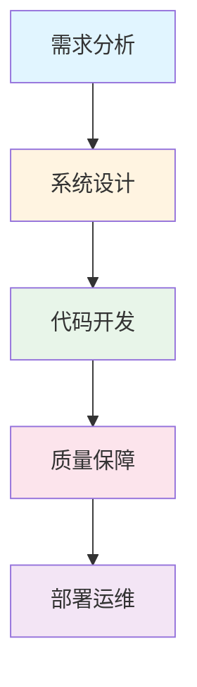

# 🚀 HAFW Platform: AI 驱动的全流程开发革命

> **让 AI 成为你的全栈开发团队** - 从需求到部署，27 个智能体指令完成整个软件开发生命周期

[](LICENSE.md)
[](docs/repo/INSTALL.md)

---

## 💡 你是否经历过这些痛苦？

- 📋 **需求模糊**: "做一个积分系统" - 然后呢？功能边界在哪？
- 🏗️ **设计缺失**: 直接写代码，最后发现架构一塌糊涂
- 🐛 **质量失控**: 没有测试、没有代码审查，上线即事故
- 📦 **部署困难**: 开发环境跑得好好的，一上线就报错

**HAFW (High-efficiency AI Framework Workspace)** 就是为了解决这些问题而生。

---

## ✨ 核心理念：把软件工程最佳实践装进 AI

HAFW 不是简单的代码生成工具，而是一套**AI 驱动的开发方法论**：



### 🎯 六大阶段 · 二十七式智能体指令

| 阶段 | 目标 | 核心指令 | 产出物 |
|------|------|----------|--------|
| **P0: 项目初始化** | 建立上下文 | `/hafw-context-init` | 项目知识库 |
| **P1: 需求分析** | 明确做什么 | `/hafw-req-analysis`<br>`/hafw-req-spec` | PRD 文档 + 任务清单 |
| **P2: 系统设计** | 规划怎么做 | `/hafw-design-arch`<br>`/hafw-design-db` | 架构设计 + DB 设计 + API 文档 |
| **P3: 代码开发** | 实现功能 | `/hafw-dev-code`<br>`/hafw-dev-test` | 可运行代码 + 单元测试 |
| **P4: 质量保障** | 确保质量 | `/hafw-qa-scan`<br>`/hafw-qa-report` | 质量报告 + 问题清单 |
| **P5: 部署运维** | 上线监控 | `/hafw-deploy-monitor` | 部署文档 + 监控配置 |

---

## 🎓 技能解析：为什么这样设计？

### 1️⃣ **上下文管理 - AI 的长期记忆**

传统 AI 编程助手的问题：**没有项目记忆**，每次对话都是新的开始。

HAFW 的解决方案：
```
.hafw/{project}/
├── contexts/      # 多维度上下文（API、架构、数据模型、编码规范）
├── requirements/  # 需求演进历史
├── architecture/  # 架构决策记录
├── development/   # 开发上下文（NOT 部署！）
└── deployment/    # 部署配置
```

**价值**: AI 理解你的项目脉络，越用越聪明。

### 2️⃣ **六阶段方法论 - 软件工程的智慧**

每个阶段对应软件工程的关键环节：

```
需求分析 (P1) → 解决"做什么"
    ↓
系统设计 (P2) → 解决"怎么架构"
    ↓
代码开发 (P3) → 解决"怎么实现"
    ↓
质量保障 (P4) → 解决"怎么验证"
    ↓
部署运维 (P5) → 解决"怎么上线"
```

**价值**: 强制遵循工程规范，避免"野路子开发"。

### 3️⃣ **智能体协同 - 27 个角色的配合**

每个指令都是一个专业领域的 AI 智能体：

- 📊 **产品经理智能体**: `/hafw-req-*` 系列
- 🏛️ **架构师智能体**: `/hafw-design-*` 系列  
- 👨‍💻 **开发工程师智能体**: `/hafw-dev-*` 系列
- 🔍 **测试工程师智能体**: `/hafw-qa-*` 系列
- 🔧 **运维工程师智能体**: `/hafw-deploy-*` 系列

**价值**: 获得整个团队的智慧，而不是单个程序员的经验。

---

## ⚡ 快速上手：10 分钟完成第一个完整流程

### Step 1: 安装 (3 分钟)

```bash
# 1. 安装 CLI
npm install -g hafw-cli

# 2. 初始化项目
cd your-project
hafw init $(basename "$PWD")

# 3. 验证
hafw context-show
```

✅ **检查清单**:
- [ ] `hafw --version` 显示版本号
- [ ] `.hafw/` 目录已创建
- [ ] `project.json` 文件存在

### Step 2: 需求分析 (2 分钟)

```bash
# 分析需求
hafw req-analysis "实现用户积分系统，包括获取、消费、查询功能"

# 查看生成的 PRD
cat .hafw/*/requirements/PRD-*.md
```

✅ **检查清单**:
- [ ] 生成了需求分析文档
- [ ] 明确了功能边界
- [ ] 识别了关键干系人

### Step 3: 系统设计 (2 分钟)

```bash
# 架构设计
hafw design-arch PRD-用户积分系统

# 数据库设计
hafw design-db ARCH-001

# API 设计
hafw design-api ARCH-001
```

✅ **检查清单**:
- [ ] 技术选型合理
- [ ] 数据库表结构设计完整
- [ ] RESTful API 接口定义清晰

### Step 4: 代码开发 (2 分钟)

```bash
# 生成代码
hafw dev-code ARCH-001

# 生成测试
hafw dev-test 用户积分系统
```

✅ **检查清单**:
- [ ] 代码符合项目规范
- [ ] 单元测试覆盖率 > 80%
- [ ] 代码审查通过

### Step 5: 质量扫描 (1 分钟)

```bash
# 全面扫描
hafw qa-scan all

# 查看报告
hafw qa-report
```

✅ **检查清单**:
- [ ] 无严重代码异味
- [ ] 无安全漏洞
- [ ] 性能指标达标

---

## 🎯 实战场景速查

### 场景 1: 快速原型开发
```bash
hafw req-analysis "MVP: 用户登录注册"
hafw design-arch PRD-登录注册
hafw dev-code ARCH-001
# 直接运行生成的代码
```

### 场景 2: 遗留系统改进
```bash
hafw context-scan code         # 扫描现有代码
hafw dev-review src/main/java  # 代码审查
hafw qa-scan modified          # 扫描改动部分
```

### 场景 3: 团队协作
```bash
hafw task-list REQ-001              # 查看任务
hafw task-update T001 status=完成    # 更新进度
hafw context-export                  # 同步给队友
```

---

## 🔥 为什么选择 HAFW？

### VS 传统 AI 编程助手

| 维度 | 传统助手 | HAFW Platform |
|------|----------|---------------|
| **记忆能力** | 无状态对话 | 持久化知识库 |
| **流程规范** | 随意聊天 | 六阶段工程化 |
| **产出质量** | 代码片段 | 完整可运行系统 |
| **协作能力** | 单人使用 | 团队知识沉淀 |
| **可追溯性** | 聊天记录 | 完整文档链 |

### 真实效果对比

**传统方式**:
```
你："帮我写个登录功能"
AI: 生成一段代码
你: 手动整合、调试、改 bug
结果: 3 小时
```

**HAFW 方式**:
```
/hafw-req-analysis "用户登录"
/hafw-design-arch PRD-登录
/hafw-dev-code ARCH-001
/hafw-qa-scan all
结果: 30 分钟，包含需求文档、设计文档、可运行代码、测试用例
```

---

## 📚 进阶学习路径

### 🟢 入门级 (新手村)
1. ✅ 完成快速上手教程
2. ✅ 体验完整 6 阶段流程
3. ✅ 理解上下文概念

### 🟡 进阶级 (熟练工)
1. ✅ 掌握 27 个指令的组合使用
2. ✅ 根据项目类型调整工作流
3. ✅ 建立团队编码规范上下文

### 🔴 专家级 (架构师)
1. ✅ 定制行业专属模板
2. ✅ 集成 CI/CD 流水线
3. ✅ 多项目协同管理

---

## 🛠️ 技术生态兼容

### 支持的 AI 助手
- ✅ **Claude Code** (推荐)
- ✅ **GitHub Copilot**
- ✅ **Tencent CodeBuddy**
- ✅ 其他支持 Slash Command 的工具

### 支持的项目类型
- 🟢 Java / Spring Boot
- 🟢 Python / Django / Flask
- 🟢 Node.js / Express / NestJS
- 🟢 Go / Gin / Echo
- 🔵 其他语言 (需手动配置上下文)

---

## 📊 社区与反馈

### 贡献方式
- 🐛 提交 Bug 报告
- 💡 分享最佳实践
- 📝 完善文档
- 🔌 开发扩展插件

### 获取帮助
- 📖 完整文档：[docs/README.md](docs/README.md)
- 🤖 AI 自动安装指南：[docs/repo/INSTALL.md](docs/repo/INSTALL.md)
- 💬 讨论区：GitHub Issues

---

## 🎁 彩蛋：隐藏技巧

### 技巧 1: 增量开发
```bash
# 只更新改动部分
hafw context-scan modified
hafw dev-code --incremental ARCH-001
```

### 技巧 2: 跨项目复用
```bash
# 导出优秀实践
hafw context-export --template best-practice

# 导入到新项目
hafw context-import best-practice.json
```

### 技巧 3: 自动化脚本
```bash
# 一键完成 P1-P3 阶段
cat > .hafw/scripts/quick-start.sh << 'EOF'
#!/bin/bash
hafw req-analysis "$1"
hafw design-arch "PRD-$1"
hafw dev-code "ARCH-001"
EOF
```

---

## 📄 许可证

Apache License 2.0 - 开源免费使用

---

## 🚀 立即开始

```bash
# 一行命令开启 AI 驱动开发之旅
npm install -g hafw-cli && hafw init $(basename "$PWD")
```

**下一步**: 执行 `hafw req-analysis "你的第一个需求"`

---

<div align="center">

**🌟 如果这个项目对你有帮助，请给一个 Star!**

**🔄 分享给你的团队，一起提升开发效率！**

Made with ❤️ by HAFW Team | Copyright © 2026

</div>
