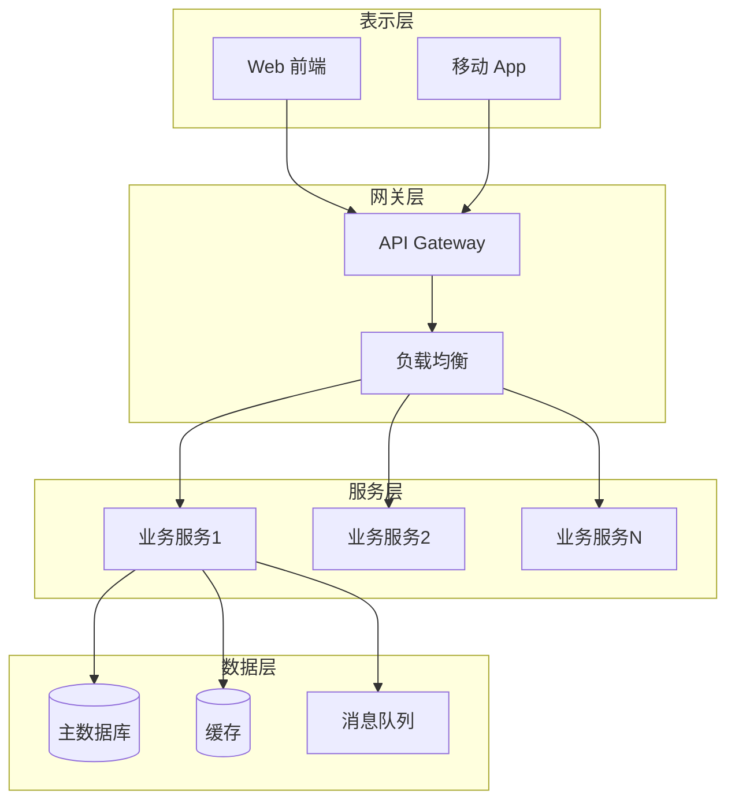
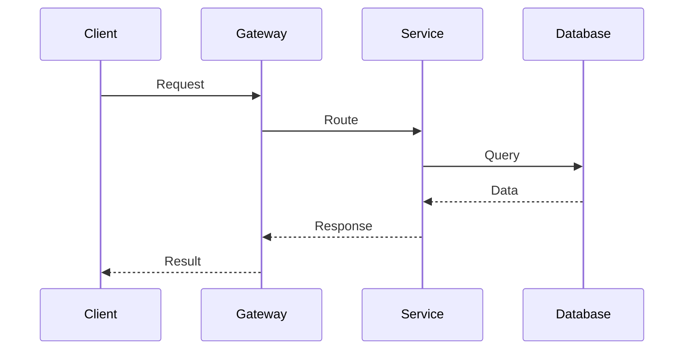
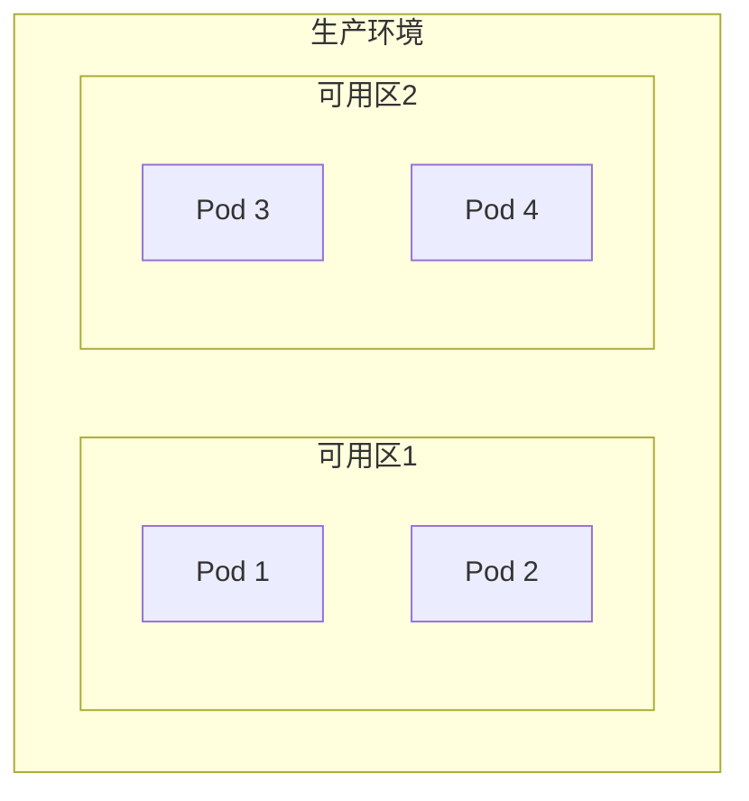

# HAFW 架构设计指令

## 目标

基于需求规范文档（PRD），生成系统架构设计，包括技术选型、组件设计、部署架构等。

## 输入

- PRD 文档路径（通过 $ARGUMENTS 或自动检测）
- 工作空间上下文（技术栈、约束条件）

## 执行步骤

### 1. 加载 PRD 文档

读取需求规范：
- 功能需求
- 非功能需求（性能、安全、可用性）
- 数据模型
- 接口需求

### 2. 技术选型

根据需求特点推荐技术栈：

| 层次 | 技术选项 | 选型依据 |
|-----|---------|---------|
| 前端 | React/Vue/Angular | 团队熟悉度、生态成熟度 |
| 后端 | Spring Boot/Node.js/Go | 性能要求、团队技能 |
| 数据库 | MySQL/PostgreSQL/MongoDB | 数据结构、事务需求 |
| 缓存 | Redis | 性能优化 |
| 消息队列 | Kafka/RabbitMQ | 异步处理需求 |
| 部署 | Docker/K8s | 可扩展性需求 |

### 3. 生成架构设计文档

```
# 系统架构设计文档

## 1. 设计目标
### 1.1 业务目标
{基于 PRD 的目标}

### 1.2 技术目标
- 高可用：99.9%
- 高性能：响应时间 < 200ms
- 可扩展：支持水平扩展
- 可维护：模块化设计

## 2. 技术架构
### 2.1 整体架构


### 2.2 技术栈
| 层次 | 技术 | 版本 | 说明 |
|-----|------|------|------|
| 前端 | React | 18.x | UI 框架 |
| 后端 | Spring Boot | 2.7.x | 应用框架 |
| 数据库 | MySQL | 8.0 | 关系型数据库 |
| 缓存 | Redis | 7.x | 分布式缓存 |

## 3. 组件设计
### 3.1 核心组件
| 组件 | 职责 | 依赖 | 部署方式 |
|-----|------|------|---------|
| {组件} | {职责} | {依赖} | {方式} |

### 3.2 组件交互


## 4. 数据架构
### 4.1 数据流


### 4.2 数据分片策略
{分片方案}

## 5. 安全架构
### 5.1 认证授权
- JWT Token 认证
- RBAC 权限控制
- OAuth2.0 集成

### 5.2 数据安全
- 传输加密：HTTPS/TLS
- 存储加密：AES-256
- 敏感数据脱敏

## 6. 部署架构
### 6.1 部署拓扑


### 6.2 CI/CD 流程


## 7. 性能设计
### 7.1 缓存策略
- L1：本地缓存（Caffeine）
- L2：分布式缓存（Redis）
- L3：数据库

### 7.2 数据库优化
- 读写分离
- 分库分表
- 索引优化

## 8. 容错设计
### 8.1 熔断降级
- 熔断器：Hystrix/Sentinel
- 降级策略：默认返回值/缓存数据

### 8.2 限流防刷
- 限流算法：令牌桶/漏桶
- 防刷策略：验证码/IP限制

## 9. 监控运维
### 9.1 监控体系
- 指标监控：Prometheus + Grafana
- 日志监控：ELK Stack
- 链路追踪：SkyWalking

### 9.2 告警策略
{告警规则}
```

## 参考模板

生成本文档时，请参考以下模板文件：
- **模板路径**: `hafw-platform/spec/architecture-spec.md`
- **模板说明**: HAFW 架构设计规范模板，包含完整的架构设计文档结构

生成文档时应遵循模板的章节结构，包括：
1. 基本信息（架构ID、系统名称、版本、状态等）
2. 架构概述（设计目标、原则、技术选型）
3. 系统架构（整体架构图、分层设计）
4. 模块设计（模块划分、详细设计、接口设计、依赖关系）
5. 数据架构（数据模型、数据库设计、索引设计）
6. 接口架构（API设计规范、接口清单）
7. 安全架构（认证授权、数据安全、防护机制）
8. 性能架构（性能指标、优化策略、缓存策略）
9. 高可用架构（可用性目标、高可用设计、容灾备份）
10. 部署架构（部署拓扑、部署清单、资源规划）
11. 监控运维（监控体系、运维手册）
12. 风险评估（风险清单、缓解措施）
13. 附录（术语表、变更记录、评审记录）

## 输出

### 架构设计文档
- 文件路径：`.hafw/{项目名称}/architecture/ARCH-{需求ID}-{系统名称}.md`

### 控制台输出

```
=== HAFW 架构设计结果 ===

设计文档: ARCH-{需求ID}-{系统名称}.md
技术栈: {主要技术}
组件数量: {count} 个

架构层次:
✅ 表示层: {技术}
✅ 网关层: {技术}
✅ 服务层: {技术}
✅ 数据层: {技术}

设计要点:
- 高可用设计: {方案}
- 性能优化: {方案}
- 安全机制: {方案}
- 扩展能力: {方案}

下一步建议 (可并行执行):
➡️ /hafw-design-db {架构ID}
   设计数据库模型

➡️ /hafw-design-api {架构ID}
   设计 API 接口

💡 提示: 数据库设计和 API 设计相互独立，可以并行执行

或者查看智能推荐:
➡️ 运行 /hafw-workflow-guide next