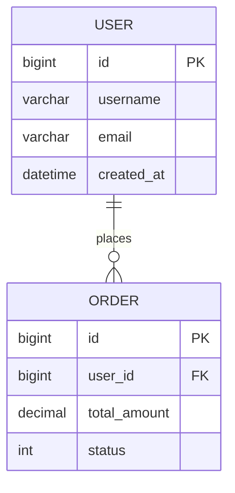

# HAFW 数据库设计指令

## 目标

基于需求规范和架构设计，生成详细的数据库设计方案，包括表结构、索引、关系等。

## 输入

- PRD 文档中的数据模型
- 架构设计中的数据架构
- 性能需求（影响索引设计）

## 执行步骤

### 1. 提取数据实体

从 PRD 中提取：
- 业务实体
- 实体属性
- 实体关系（1:1, 1:N, N:M）
- 约束条件（唯一性、非空、默认值）

### 2. 设计表结构

为每个实体设计表：

```sql
-- 示例表结构
CREATE TABLE IF NOT EXISTS {table_name} (
    id BIGINT AUTO_INCREMENT PRIMARY KEY COMMENT '主键ID',
    {field_name} {data_type} {constraints} COMMENT '字段说明',
    created_at DATETIME NOT NULL DEFAULT CURRENT_TIMESTAMP COMMENT '创建时间',
    updated_at DATETIME NOT NULL DEFAULT CURRENT_TIMESTAMP ON UPDATE CURRENT_TIMESTAMP COMMENT '更新时间',
    deleted TINYINT DEFAULT 0 COMMENT '逻辑删除标志',
    
    -- 索引
    INDEX idx_{field} ({field}),
    UNIQUE KEY uk_{field} ({field})
) ENGINE=InnoDB DEFAULT CHARSET=utf8mb4 COMMENT='{表说明}';
```

### 3. 生成数据库设计文档

```markdown
# 数据库设计文档

## 1. 设计概述
### 1.1 数据库选型
- 数据库：MySQL 8.0
- 字符集：utf8mb4
- 存储引擎：InnoDB

### 1.2 命名规范
- 表名：小写，下划线分隔，如 `user_profile`
- 字段名：小写，下划线分隔，如 `created_at`
- 索引名：`idx_` 前缀（普通索引），`uk_` 前缀（唯一索引）

## 2. 实体关系图


## 3. 表结构设计

### 3.1 {表名}
| 字段 | 类型 | 约束 | 默认值 | 说明 |
|-----|------|------|--------|------|
| id | BIGINT | PK, AUTO_INCREMENT | - | 主键 |
| {字段} | {类型} | {约束} | {默认值} | {说明} |
| created_at | DATETIME | NOT NULL | CURRENT_TIMESTAMP | 创建时间 |
| updated_at | DATETIME | NOT NULL | CURRENT_TIMESTAMP | 更新时间 |
| deleted | TINYINT | DEFAULT | 0 | 逻辑删除 |

**索引设计：**
| 索引名 | 类型 | 字段 | 说明 |
|--------|------|------|------|
| idx_{name} | 普通 | {field} | {说明} |
| uk_{name} | 唯一 | {field} | {说明} |

**DDL：**
```sql
{生成的建表语句}
```

## 4. 索引设计
### 4.1 索引策略
- 主键索引：所有表必须有自增主键
- 业务索引：根据查询条件设计
- 唯一索引：保证业务唯一性
- 联合索引：遵循最左前缀原则

### 4.2 索引列表
| 表名 | 索引名 | 类型 | 字段 | 用途 |
|-----|--------|------|------|------|
| {表} | {索引} | {类型} | {字段} | {用途} |

## 5. 分库分表策略
### 5.1 分片策略
{分片方案}

### 5.2 路由规则
{路由规则}

## 6. 数据字典
### 6.1 枚举值定义
| 字段 | 值 | 含义 |
|-----|----|------|
| status | 0 | 禁用 |
| status | 1 | 启用 |

## 7. SQL 规范
### 7.1 查询规范
- 禁止使用 SELECT *
- 大表查询必须带索引
- 分页查询优化

### 7.2 写入规范
- 批量插入优化
- 事务控制
- 乐观锁使用

## 8. 迁移脚本
### 8.1 初始化脚本
```sql
{初始化 SQL}
```

### 8.2 变更脚本
```sql
{变更 SQL}
```
```

### 4. 生成 MyBatis Mapper

为每个表生成对应的 Mapper 接口和 XML：

```java
@Mapper
public interface {Entity}Mapper extends BaseMapper<{Entity}> {
    // 自定义查询方法
}
```

```xml
<?xml version="1.0" encoding="UTF-8"?>
<!DOCTYPE mapper PUBLIC "-//mybatis.org//DTD Mapper 3.0//EN" 
    "http://mybatis.org/dtd/mybatis-3-mapper.dtd">
<mapper namespace="{package}.{Entity}Mapper">
    <!-- 基础 CRUD 由 MyBatis-Plus 提供 -->
</mapper>
```

## 输出

### 数据库设计文档
- 文件路径：`.hafw/{项目名称}/design/DB-{需求ID}-{数据库名称}.md`

### DDL 脚本
- 文件路径：`.hafw/{项目名称}/design/ddl/{表名}.sql`

### 控制台输出

```
=== HAFW 数据库设计结果 ===

设计文档: DB-{需求ID}-{数据库名称}.md
表数量: {count} 张
索引数量: {count} 个

表结构:
✅ {表1} - {字段数} 个字段
✅ {表2} - {字段数} 个字段
...

生成文件:
- DDL 脚本: {path}
- Mapper 接口: {path}
- Mapper XML: {path}

设计要点:
- 主键策略: 自增 ID
- 逻辑删除: 统一 deleted 字段
- 时间戳: created_at, updated_at
- 索引优化: {策略}

下一步建议:
1. 运行 /hafw-design-api 进行 API 设计
2. 运行 /hafw-dev-code 开始代码生成
3. 执行 DDL 脚本创建数据库
```

