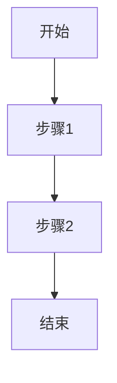

# HAFW 需求智能分析指令

## 目标

分析用户提供的原始需求，提取关键信息，生成结构化的需求分析文档。

## 输入

用户提供的原始需求描述（通过 $ARGUMENTS 获取）

## 执行步骤

### 1. 需求接收与理解

读取用户输入的需求描述：
```
$ARGUMENTS
```

### 2. 需求解析

分析需求的关键要素：
- **功能需求**: 用户想要实现什么功能
- **非功能需求**: 性能、安全、可用性等要求
- **业务场景**: 需求适用的业务场景
- **用户角色**: 涉及的用户类型
- **约束条件**: 技术约束、时间约束、资源约束

### 3. 关键信息提取

提取以下信息：

| 信息类别 | 提取内容 |
|---------|---------|
| 核心功能 | 主要功能点列表 |
| 业务流程 | 业务流程图描述 |
| 数据实体 | 涉及的数据对象 |
| 接口需求 | 系统间交互需求 |
| 质量属性 | 性能、安全、可靠性要求 |

### 4. 生成需求分析文档

创建结构化的需求分析文档：

```markdown
# 需求分析文档

## 1. 需求概述
- 需求名称：
- 需求描述：
- 优先级：
- 预期交付时间：

## 2. 功能需求
### 2.1 核心功能
- [ ] 功能点1
- [ ] 功能点2

### 2.2 业务流程


## 3. 非功能需求
- 性能要求：
- 安全要求：
- 可用性要求：

## 4. 数据模型
- 实体1：属性列表
- 实体2：属性列表

## 5. 风险评估
- 技术风险：
- 业务风险：
- 缓解措施：
```

### 5. 输出结果

将分析结果输出到：
- 文件路径：`.hafw/{项目名称}/requirements/REQ-{YYYYMMDD}-{需求名称}.md`
- 同时在控制台输出分析摘要

## 输出格式

```
=== HAFW 需求分析结果 ===

需求名称: {提取的需求名称}
核心功能: {功能点数量} 个
业务实体: {实体数量} 个
风险等级: {高/中/低}

详细文档: .hafw/{项目名称}/requirements/REQ-{日期}-{名称}.md

下一步建议:
➡️ 运行 /hafw-req-spec {需求ID}
   基于分析结果生成标准化 PRD 文档

或者查看智能推荐:
➡️ 运行 /hafw-workflow-guide next
```

## 注意事项

- 需求不明确时，应主动询问用户澄清
- 识别出潜在的技术债务应提前预警
- 复杂需求建议分解为多个子需求
