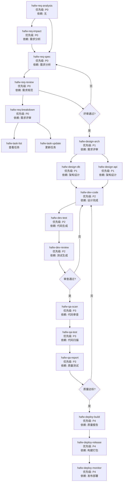

# HAFW 执行流程指南

## 指令执行优先级和依赖关系



## 执行阶段说明

### 阶段 1: 需求分析 (P0 - 最高优先级)
| 顺序 | 指令 | 依赖 | 输入 | 输出 | 下一步 |
|-----|------|------|------|------|--------|
| 1 | `hafw-req-analysis` | 无 | 用户原始需求 | 需求分析文档 | ➡️ hafw-req-impact / hafw-req-spec |
| 1.5 | `hafw-req-impact` | 需求分析 | 需求分析+代码仓库 | 影响分析报告 | ➡️ hafw-req-spec |
| 2 | `hafw-req-spec` | 需求分析 | 需求分析文档 | PRD 规范文档 | ➡️ hafw-req-review |
| 3 | `hafw-req-review` | PRD 文档 | PRD 文档 | 评审报告 | ➡️ hafw-req-breakdown |
| 3.5 | `hafw-req-breakdown` | 需求评审 | PRD+影响分析 | 任务清单 | ➡️ 任务管理 |

### 阶段 1.5: 任务管理 (贯穿全程)
| 指令 | 依赖 | 输入 | 输出 | 说明 |
|-----|------|------|------|------|
| `hafw-task-list` | 任务清单 | 任务ID/负责人/状态 | 任务列表 | 查看所有任务进度 |
| `hafw-task-update` | 任务ID | 状态/进度/备注 | 更新后的任务 | 更新任务执行状态 |

**⚠️ 阶段检查点**: 需求评审必须通过才能进入设计阶段

---

### 阶段 2: 系统设计 (P1)
| 顺序 | 指令 | 依赖 | 输入 | 输出 | 下一步 |
|-----|------|------|------|------|--------|
| 4 | `hafw-design-arch` | ✅ PRD 文档<br/>✅ 评审通过 | PRD 文档 | 架构设计文档 | ➡️ hafw-design-db<br/>➡️ hafw-design-api |
| 5 | `hafw-design-db` | ✅ 架构设计 | 架构设计+数据模型 | 数据库设计文档 | ➡️ 开发阶段 |
| 5 | `hafw-design-api` | ✅ 架构设计 | 架构设计+接口需求 | API 设计文档 | ➡️ 开发阶段 |

**⚠️ 并行执行**: hafw-design-db 和 hafw-design-api 可以并行执行

---

### 阶段 3: 代码开发 (P2)
| 顺序 | 指令 | 依赖 | 输入 | 输出 | 下一步 |
|-----|------|------|------|------|--------|
| 6 | `hafw-dev-code` | ✅ 架构设计<br/>✅ 数据库设计<br/>✅ API 设计 | 全部设计文档 | 源代码文件 | ➡️ hafw-dev-test |
| 7 | `hafw-dev-test` | ✅ 代码生成 | 源代码 | 测试代码 | ➡️ hafw-dev-review |
| 8 | `hafw-dev-review` | ✅ 测试生成 | 代码+测试 | 审查报告 | ➡️ 质量阶段 |

**⚠️ 阶段检查点**: 代码审查必须通过才能进入质量阶段

---

### 阶段 4: 质量保障 (P3)
| 顺序 | 指令 | 依赖 | 输入 | 输出 | 下一步 |
|-----|------|------|------|------|--------|
| 9 | `hafw-qa-scan` | ✅ 代码审查通过 | 源代码 | 扫描报告 | ➡️ hafw-qa-test |
| 10 | `hafw-qa-test` | ✅ 代码扫描 | 代码+测试 | 测试报告 | ➡️ hafw-qa-report |
| 11 | `hafw-qa-report` | ✅ 质量测试 | 全部质量数据 | 质量报告 | ➡️ 部署阶段 |

**⚠️ 阶段检查点**: 质量报告必须达标才能进入部署阶段

---

### 阶段 5: 部署运维 (P4)
| 顺序 | 指令 | 依赖 | 输入 | 输出 | 下一步 |
|-----|------|------|------|------|--------|
| 12 | `hafw-deploy-build` | ✅ 质量达标 | 源代码 | 构建产物 | ➡️ hafw-deploy-release |
| 13 | `hafw-deploy-release` | ✅ 构建打包 | 构建产物 | 部署结果 | ➡️ hafw-deploy-monitor |
| 14 | `hafw-deploy-monitor` | ✅ 发布部署 | 运行中的应用 | 监控配置 | ➡️ 完成 |

---

## 快速开始

### 1. 初始化项目
```bash
# 初始化 HAFW 项目上下文
/hafw-context-init 用户积分系统

# 查看当前上下文
/hafw-context-show
```

### 2. 查看完整流程
```bash
/hafw-workflow-guide full
```

### 查看下一步应该执行什么
```bash
/hafw-workflow-guide next
```

输出示例：
```
=== HAFW 下一步执行建议 ===

当前状态: 需求分析已完成
下一步指令: /hafw-req-spec

执行理由:
- 需求分析文档已生成: REQ-20240313-用户积分系统.md
- 需要基于分析结果生成标准化 PRD 文档

所需输入:
- 需求分析文档路径: .hafw/{项目名称}/requirements/REQ-20240313-用户积分系统.md

预期输出:
- PRD 文档: .hafw/{项目名称}/requirements/PRD-用户积分系统.md

执行命令:
/hafw-req-spec REQ-20240313-用户积分系统

后续步骤:
1. /hafw-req-review (评审 PRD)
2. /hafw-design-arch (架构设计)
```

### 检查当前状态
```bash
/hafw-workflow-guide check
```

输出示例：
```
=== HAFW 执行状态检查 ===

已完成的阶段:
✅ P0 需求分析
   ✅ hafw-req-analysis
   ✅ hafw-req-spec
   ✅ hafw-req-review

当前阶段:
🔄 P1 系统设计
   ⏳ hafw-design-arch (等待执行)
   ⬜ hafw-design-db
   ⬜ hafw-design-api

待执行阶段:
⬜ P2 代码开发
⬜ P3 质量保障
⬜ P4 部署运维

阻塞原因:
- 需要先生成 PRD 文档

建议操作:
/hafw-design-arch PRD-用户积分系统
```

---

## 依赖检查清单

### 执行前自动检查
每个指令执行前会自动检查依赖：

| 指令 | 依赖文件 | 检查命令 |
|-----|---------|---------|
| hafw-req-spec | REQ-*.md | `ls .hafw/{项目名称}/requirements/REQ-*.md` |
| hafw-req-review | PRD-*.md | `ls .hafw/{项目名称}/requirements/PRD-*.md` |
| hafw-design-arch | PRD-*.md + 评审通过标记 | `grep "评审结果: 通过" REVIEW-*.md` |
| hafw-design-db | ARCH-*.md | `ls .hafw/{项目名称}/design/ARCH-*.md` |
| hafw-design-api | ARCH-*.md | `ls .hafw/{项目名称}/design/ARCH-*.md` |
| hafw-dev-code | ARCH-*.md + DB-*.md + API-*.md | 检查全部设计文档 |
| hafw-dev-test | 源代码 | `find src -name "*.java" \| head -5` |
| hafw-dev-review | 代码 + 测试 | 检查 src/main 和 src/test |
| hafw-qa-scan | 代码审查通过 | `grep "审查结果: 通过" code-review-*.md` |
| hafw-qa-test | 扫描报告 | `ls .hafw/{项目名称}/qa/scan-report-*.md` |
| hafw-qa-report | 测试报告 | `ls .hafw/{项目名称}/qa/test-report-*.md` |
| hafw-deploy-build | 质量报告达标 | `grep "质量评分: [8-9][0-9]/100" quality-report-*.md` |
| hafw-deploy-release | 构建产物 | `ls target/*.jar` |
| hafw-deploy-monitor | 部署成功 | `kubectl get pods` |

---

## 执行提示示例

### 示例 1: 需求分析完成后的提示
```
✅ hafw-req-analysis 执行完成！

生成文件:
- .hafw/{项目名称}/requirements/REQ-20240313-用户积分系统.md

下一步:
➡️ 运行 /hafw-req-spec REQ-20240313-用户积分系统
   生成标准化的 PRD 文档

或者:
➡️ 运行 /hafw-workflow-guide next
   查看智能推荐
```

### 示例 2: 缺少依赖时的提示
```
❌ 无法执行 hafw-design-arch

缺少依赖:
- 未找到已评审通过的 PRD 文档

当前状态:
- 找到 PRD 文档: PRD-用户积分系统.md
- 未找到评审报告

建议操作:
1. 先执行 /hafw-req-review PRD-用户积分系统
2. 确保评审通过后再执行设计

或者:
➡️ 运行 /hafw-workflow-guide check
   查看完整状态
```

### 示例 3: 可以并行执行时的提示
```
✅ hafw-design-arch 执行完成！

生成文件:
- .hafw/{项目名称}/design/ARCH-001-用户积分系统.md

下一步 (可并行执行):
➡️ /hafw-design-db ARCH-001-用户积分系统
   设计数据库模型

➡️ /hafw-design-api ARCH-001-用户积分系统
   设计 API 接口

建议:
数据库设计和 API 设计相互独立，可以并行执行以提高效率。
```
